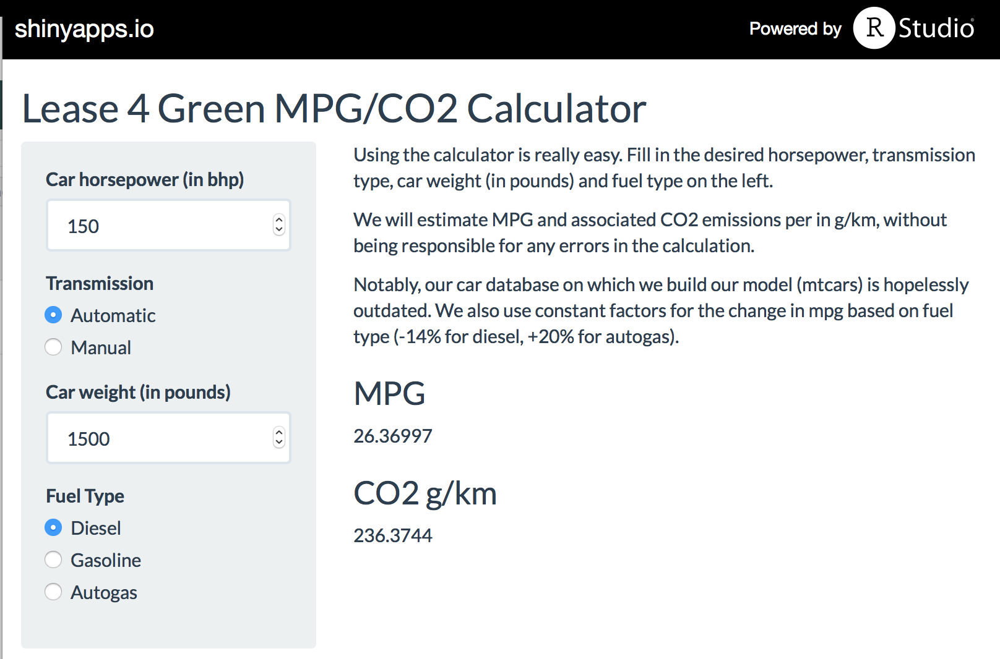

## Context
- Tax incentives are changing the leasing landscape in many countries
  - Governments want to <span style="color:red">collect more taxes</span>
  - Governments want to create incentives for <span style="color:green">green behavior</span>
- CO2 efficiency now has a <b>MAJOR</b> impact on the <b>value for money</b> of a leasing contract
<div style='text-align: center;'>
    
</div>

---

## Motivation
- Hard time making a <b>trade-off</b> between MPG/CO2 emissions and
  - Luxury, comfort
      - Automatic transmission versus manual transmission
      - Car size and weight
  - <span style="color:red">Fun</span> factor
      - Horsepower
      - Fuel type
- Many car types available with individual specs for all parameters and MPG/CO2 outcome

<h3><b>Allow customers to  <span style="color:red">explore</span> MPG/CO2-related trade-offs without wading through specific car models</b></h3>


---

## Approach
- Model impact of different vehicle paramaters on MPG and CO2 impact
    - Currently, based on a simple regression model with `mtcars`
        - `lm(mtcars$mpg ~ hp + wt + am + wt:am, data = mtcars)`
    - Constant factors for fuel type impact on fuel consumption
- Fast prototyping using <b>Shiny</b> and <b>R</b>
- Deployment on shiny.io : [https://cfm-ds.shinyapps.io/Project](https://cfm-ds.shinyapps.io/Project)

<div style='text-align: left;margin-top:15px;margin-left:15px'>
    
</div>

--- .class #id

## Model & Example
- R model code with example prediction call for MPG and CO2: 
```{r}
co2_f <- data.frame("diesel" = 6233, "gasoline" = 5456, "autogas" = 4469)
fuel_f <- data.frame("diesel" = 1.14, "gasoline" = 1, "autogas" = 0.8)

mtcars$am <- as.factor(mtcars$am)
model <- lm(mtcars$mpg ~ hp + wt + am + wt:am, data = mtcars)

mpg <- predict(model,  data.frame(hp = 150, wt = 1.5, am = "0")) * fuel_f[ ,"diesel"]
co2 <- co2_f[ ,"diesel"]/mpg

data.frame(mpg = mpg, co2 = co2)
```
